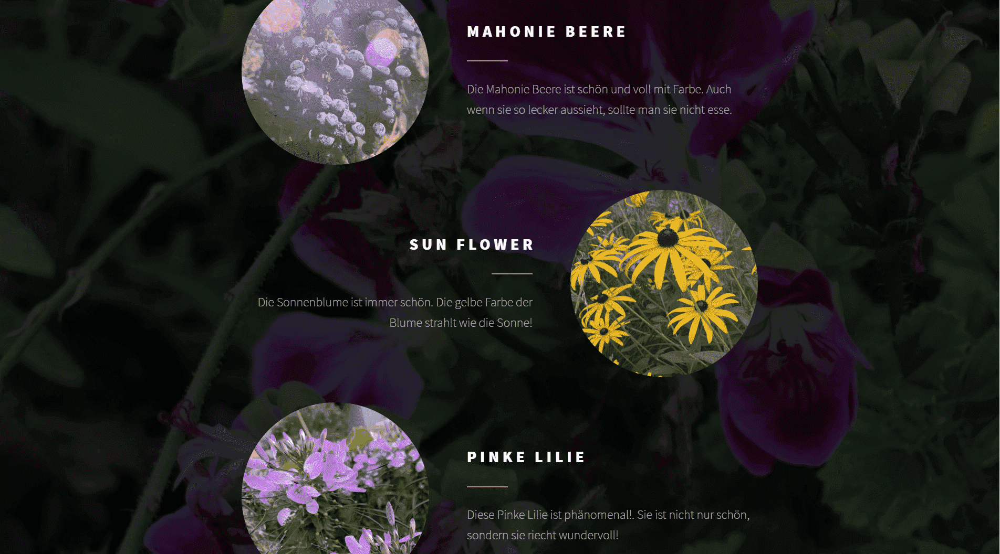

+++
title = "Flora"
date = "2020-08-19"
draft = false
pinned = false
image = "blog-19.08.20-1-.png"
+++
Heute habe ich zusammen mit Lucas eine Website für unser fiktives Unternehmen "Flora" eine Website mit selbst geschossenen Bildern erstellt. Das fiktive Unternehmen handelt, wie im Namen schon erkennbar ist, mit Blumen. Um unserer Webseite eine Echtheit zu verleihen, haben wir in der Umgebung jegliche Pflanzen fotografiert.

Die Webseite hat in kurzer Zeit schon Form angenommen (ca. 45 Minuten). Jedoch hat sie auch noch viel Verbesserungspotenzial, denn gewisse Verbindungen wie zu unseren Produkten fehlen noch. Auch das Layout könnte man noch etwas bearbeiten.

Das Fazit, dass ich daraus ziehen kann ist, dass es gar nicht so schwierig ist eine eigene Webseite zu erstellen. Auch benötigt es nicht so viel Zeit, wie ich bemerkt habe da wir nur 45 Minuten Zeit hatten.