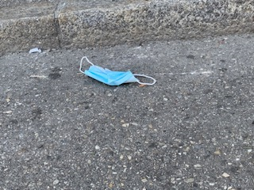
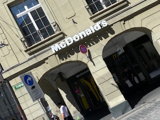
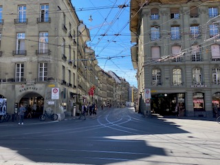

+++
title = "Probleme und Lösungen"
date = "2020-08-26"
draft = false
pinned = false
image = "netflix.png"
+++
Ideen hat man Alltag, kann man diese jedoch umsetzten und werden diese überhaupt von anderen gebraucht? 

Denn ein Projekt kann nach der Umsetzung nur erfolgreich sein, wenn dies eine Lösung zu einem Problem der Menschen ist. Deshalb haben wir uns auf den Weg gemacht, um in Bern Probleme oder Bedürfnisse der Menschen zu analysieren.

In Bern haben ich und Lucas uns auf die Suche nach möglichen Problemen oder Bedürfnissen gemacht. Dabei ist uns aufgefallen, dass schon jetzt überall verwertete Masken herumliegen. Auch bei einer kleinen Umfrage, wird uns gesagt, dass diese Masken dem Bild schaden und dass es nicht gut aussieht. Um dies zu verhindern kann man Abfalleimer regelmässiger und einfacher erreichbar macht.

Die Gesellschaft hat Fast Food über Zeit normalisiert. Jedoch wendet sie sich wieder anderen - gesünderen Alternativen zu. In der Stadt fällt jedoch auf: an fast jeder Ecke findet man ein Fast Food Restaurant, egal ob Mc Donalds, Burger King oder Subway. Es gibt also überall billiges aber ungesundes Wo findet man aber schnelle und billige gesunde Alternativen? 

