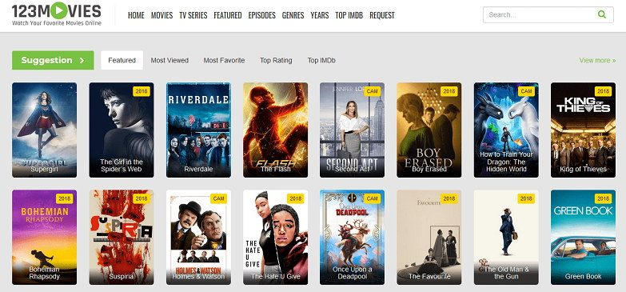

+++
title = "𝐓𝐡𝐞 𝐧𝐞𝐱𝐭 𝐟𝐞𝐰 𝐬𝐭𝐞𝐩𝐬..."
date = "2020-09-09"
draft = false
pinned = false
image = "goals.jpg"
+++
Heute haben wir in der Gruppe die weiteren Schritte für unser Projekt besprochen. Unser Ziel ist es eine Webseite sowie eine App für Empfehlungen, Tipps und weitere Funktionen für eine Serie zumachen.

Steps:

\- Skizze/Vorstellung Webseite und App

\- Test-Webseite erstellen (<!--StartFragment--> <https://lunoja.carrd.co/#> <!--EndFragment-->)

\- Testversion der Webseite mit Dritten austesten

\- Webseite und App (Ideen) anpassen

\- Ideen weiter ausführen

Auf unserer Webseite und der App möchten wir die Serien kurz zusammenfassen und unsere persönliche Meinung in ein Rating einbringen. Dabei möchten wir die Serien in verschiedene Kategorien aufteilen (z.B Comedy, Horror, etc.). Auch hatten wir die Idee ein Quiz zu gestalten welches dann zu persönlichen Vorschlägen für Serien führt. Wenn man diese oder eine andere Serie schon gesehen hat, kann man dies in einem separaten Register der Website eintragen (persönlich).

Dazu haben wir schon eine Art Testversion der Webseite kreiert. (<!--StartFragment--> <https://lunoja.carrd.co/#> <!--EndFragment-->).