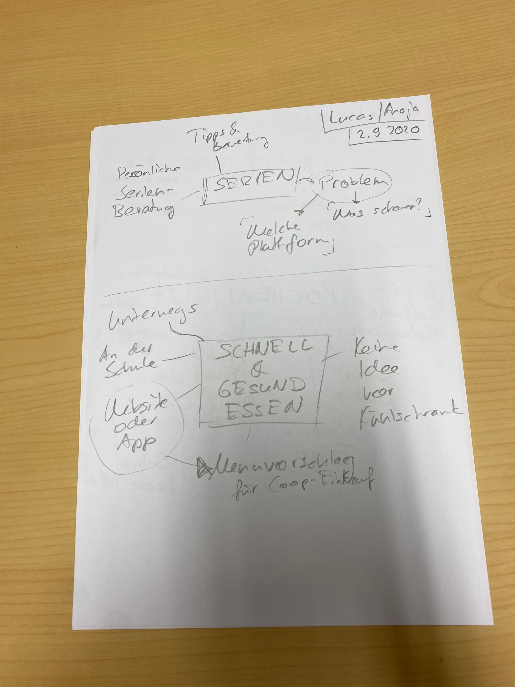

+++
title = "𝐖𝐚𝐬 𝐤𝐚𝐧𝐧 𝐦𝐚𝐧 𝐚𝐮𝐬 𝐝𝐢𝐞𝐬𝐞𝐧 𝐏𝐫𝐨𝐛𝐥𝐞𝐦𝐞𝐧 𝐨𝐝𝐞𝐫 𝐁𝐞𝐝ü𝐫𝐟𝐧𝐢𝐬𝐬𝐞𝐧 𝐦𝐚𝐜𝐡𝐞𝐧?"
date = "2020-09-02"
draft = false
pinned = false
image = "photo-1586899028174-e7098604235b.jpg"
+++
Letzte Woche haben wir uns auf die Suche nach Problemen und Bedürfnissen anderer Menschen gemacht., welche wir in ein Produkt also in ein Projekt einarbeiten können. Dabei haben wir die vielfältige Auswahl an Serien und deren Zugänglichkeit als Problem für die Jugendlichen erkannt. Denn oft wissen diese nicht was und wo sie etwas schauen können. Zudem ist uns aufgefallen, dass es nicht viele gesunde Optionen, zu Fast-Food Chains wie McDonalds, gibt.

Aus dem Bedürfnis der Jugendlichen sich einfach für eine Serie entscheiden zu können und direkt zu wissen wo sie  diese streamen/anschauen können. Daraus entstand unsere Idee, einer Webseite welche Serien kurz beschreibt und bewertet. Um die Nützlichkeit dieser Idee zu testen, haben wir eine Test-Version der Webseite aufgestellt. Um dies an Dritte weiterzugeben und deren Reaktionen auszuwerten.

Für das Bedürfnis von gesünderen aber weiterhin schnellen Mahlzeiten, hatten wir die Idee einer App oder Website welche gesündere Optionen in der Nähe vorschlägt. Auf dieser Webseite könnten auch Mahlzeiten angezeigt werden welche aus mehreren Zutaten bestehen, welche man schnell zu einem feinen Essen verwandeln kann.