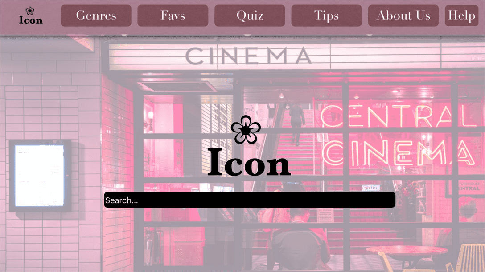

+++
title = "𝐃𝐞𝐫 𝐡𝐨𝐥𝐩𝐫𝐢𝐠𝐞 𝐖𝐞𝐠 𝐳𝐮𝐦 𝐙𝐢𝐞𝐥"
date = "2020-10-21"
draft = false
pinned = false
image = "photo-1471958680802-1345a694ba6d-1-.jpg"
+++
Die Arbeit fand heute ohne Aufsichtsperson statt, wir konnten trotzdem an unserer Idee weiterarbeiten sowie das Programmieren weiter anwenden. Zuerst haben wir unsere Ideen zur Website ausgetauscht, um so das Design dafür aufzustellen/vorbereiten. Wir haben uns auf das generelle Design der Homepage und deren Buttons (Links zu anderen Teilen der Seite) geeinigt.

Dazu haben wir uns noch auf das Programmieren der Website fokussiert. Wir haben weitere grundlegende Elemente einer Website kennengelernt. Diese Elemente haben wir mit dem Tool und der Anleitung (auf <!--StartFragment-->[https://code.makery.ch/de/library/html-css/](https://code.makery.ch/de/library/html-css/ "https\://code.makery.ch/de/library/html-css/")<!--EndFragment--> ) ausprobiert. Beim Programmieren sind wir soweit gekommen, dass wir bald zur "Veröffentlichung" der Übungswebsite kommen.