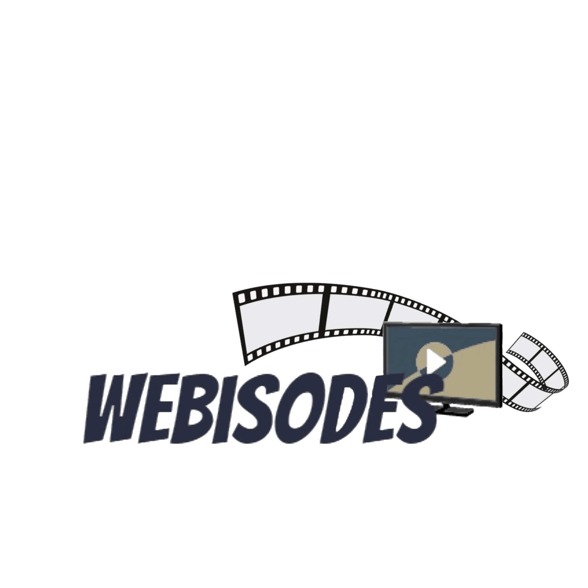
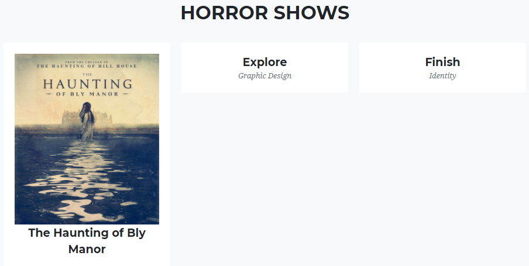
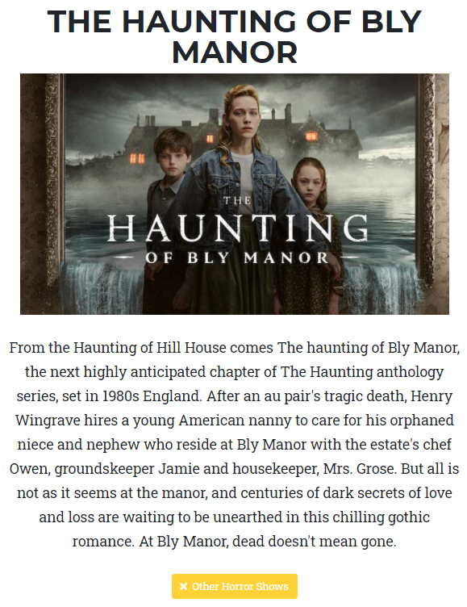

+++
title = "𝐎𝐮𝐫 𝐰𝐞𝐛𝐬𝐢𝐭𝐞 𝐬𝐭𝐢𝐥𝐥 𝐧𝐞𝐞𝐝𝐬 𝐰𝐨𝐫𝐤..."
date = "2020-12-09"
draft = false
pinned = false
image = "sdfgedsahjn.png"
+++
Glücklicherweise konnten wir heute beide wieder zusammen, vor Ort arbeiten. Wir haben heute als erstes die Planung aktualisiert und die vorausgesehenen Tätigkeiten für den heutigen Nachmittag festgelegt. Darunter befand sich unteranderem, das Finden eines Namens sowie das Designen des Logos.

## Heutige Tätigkeiten

Heute haben wir zudem versucht das Gerüst für die einzelnen Kategorien, also für die Genres, aufzubauen. Für dies haben wir die einzelnen Seiten mit Links erstellt und die bearbeitet. Nächstes Mal werden wir höchstwahrscheinlich weiter an diesen Arbeiten um das Design zu verbessern.

Bei den Kategorien haben wir auch schon Beispielserien eingefügt, wie hier auf dem Bild "The Haunting Of Bly Manor".

