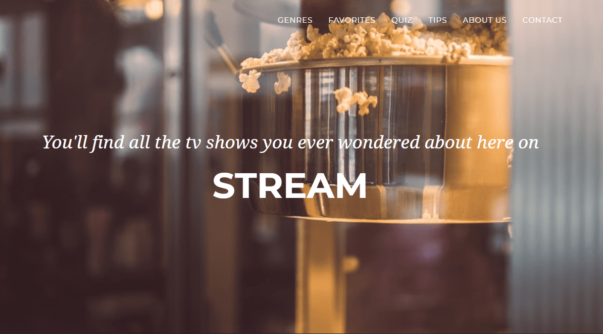
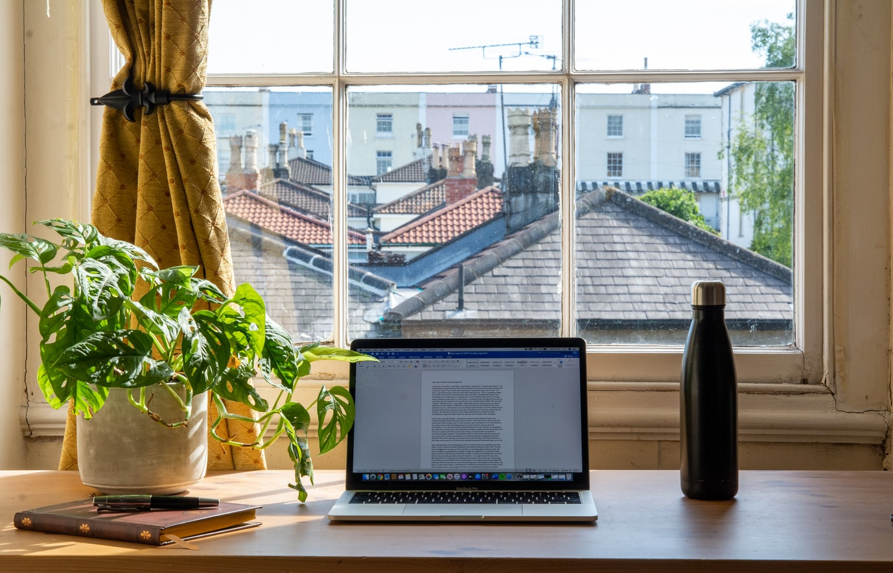

+++
title = "𝐓𝐡𝐞 𝐬𝐭𝐚𝐫𝐭 𝐨𝐟 𝐨𝐮𝐫 𝐰𝐞𝐛𝐬𝐢𝐭𝐞"
date = "2020-12-02"
draft = false
pinned = false
image = "photo-1544847558-3ccacb31ee7f.jpg"
+++
## Arbeit von hier aus

Da mein Teamkollege heute nicht präsent sein konnte, habe ich alleine am Projekt weitergearbeitet. Dabei haben wir uns heute auf das Projekt selbst, also auf das Programmieren der Webseite für Serien konzentriert. Ich habe das Design der Startseite angepasst und so verbessert. Sowohl habe ich auch die Navigation und die Navigations-Bar bearbeitet, so dass diese unserem Projekt entspricht. 

## Arbeit aus dem Home-Office

Lucas hat heute im Home-Office gearbeitet, weshalb die Zusammenarbeit etwas schwieriger als sonst gestaltet war. Wir haben jedoch zusammen durch die verschiedenen Tools (wie Teams und Telefon) miteinander kommuniziert und uns über die Arbeit ausgetauscht. Durch die Funktion des Bildschirm teilens konnte Lucas das Programmieren der Webseite auch von zuhause aus mitverfolgen und seine Meinungen zum Design äussern. Zudem hat Lucas an den einzelnen Beiträgen für die ausgewählten "Start-Serien" gearbeitet. Er hat dazu die kurzen Beschriebe verfasst und das Rating der Serien festgelegt.

## Wie geht es weiter?

Auch nächste Woche werden wir wieder an der Webseite für unser Projekt weiterarbeiten, hoffentlich dieses mal wieder zu zweit. In der nächsten Arbeitsphase möchten wir die Startseite fertig programmieren und mit dem Programmieren der Unterkategorien beginnen. So dass das Grundgerüst der Webseite schon einmal vorhanden ist und wir auf diesem aufbauen können. Dabei müssen wir uns auch noch für einen Namen entscheiden.