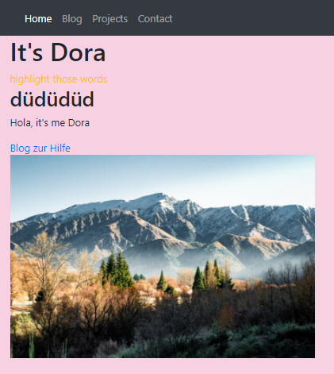

+++
title = "𝐖𝐞𝐛𝐝𝐞𝐬𝐢𝐠𝐧"
date = "2020-11-11"
draft = false
pinned = false
image = "photo-1484417894907-623942c8ee29.jpg"
+++
Heute haben wir weitere Dinge des Programmierens ausgetestet und somit gelernt. Dabei haben wir uns am Tutorial auf <https://code.makery.ch/library/html-css/> orientiert und sind bei diesem schon fast fertig. Dabei müssen wir noch die letzten Teile mit der Device-Kompatibilität der Website bearbeiten.

## Vergleich

Heute haben wir aber also einiges Neues dazu gelernt und konnten die Übungswebsite also um einiges schöner gestalten. Dies haben wir mit Hilfe des CSS und dem Bootstrap erreicht.

Zum Vergleich:

Dabei kann man sehen, dass wir einige neue "Seiten" dazufügen konnten. Auch haben wir für diese verschiedenen Teile der Website die Navigation erstellt, welche man oben an der Website sehen kann.