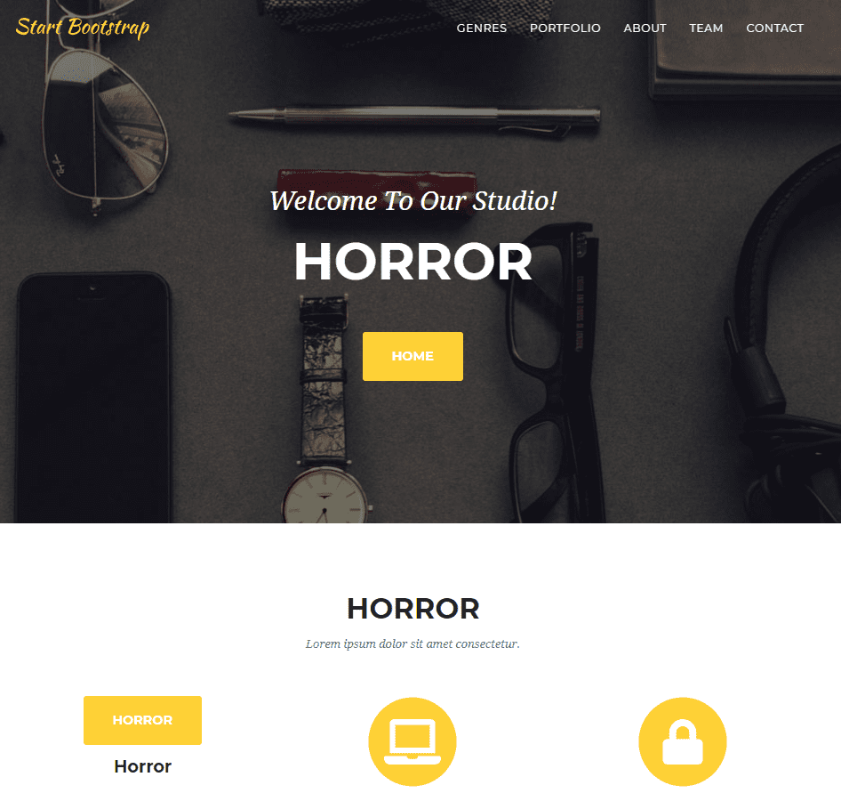

+++
title = "𝐰𝐨𝐫𝐤𝐢𝐧𝐠 𝐨𝐧 𝐭𝐡𝐞 𝐩𝐫𝐨𝐣𝐞𝐜𝐭"
date = "2020-11-18"
draft = false
pinned = false
image = "photo-1572177812156-58036aae439c.jpg"
+++
Heute haben wir an unserer ursprünglichen Idee für das Projekt weitergearbeitet. Wir haben unteranderem unsere Planung aktualisiert und uns das Design der Website überlegt. 

WIr haben uns Möglichkeiten für das persönliche "Serien-Quiz" überlegt, dabei kam durch die Lehrperson die Idee von persönlichen Empfehlungen auf. Bei diesem würden Website-Besucher die Anliegen und/oder Wünsche in einem Formular auf der Webseite festhalten und dafür persönliche Empfehlungen für Serien erhalten.

Um die Website aufzustellen haben wir ein bootstrap heruntergeladen, um die Arbeit des Programmierens (schreiben des htmls) etwas zu erleichtern und kürzen. Dort haben wir gewisse Dinge, wie die Menüleiste und deren Seiten versucht aufzuarbeiten. Wir sind damit noch nicht extrem weit gekommen, jedoch haben wir geplant daran auch übernächste Woche weiterzuarbeiten.

