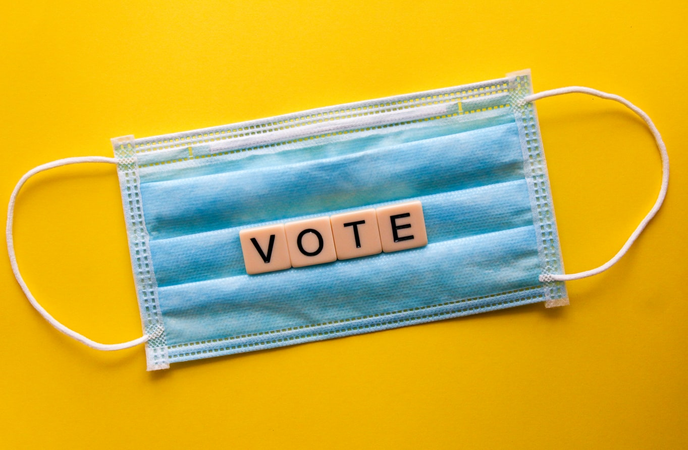

+++
title = "𝐓𝐡𝐞 𝘀𝘆𝘀𝘁𝗲𝗺..."
date = "2020-11-04"
draft = false
pinned = false
image = "photo-1547190027-9156686aa2f0.jpg"
+++
Damit wir die grundlegenden Züge des Programmierens einer Webseite erkennen und verstehen können, haben wir dafür 2 Lektionen aufgewendet. Wir haben weiter an unserer Übungswebsite gearbeitet, so haben wir heute nicht nur html zum Programmieren genutzt, sondern auch css. Dies ist ein Teil des Programmierens, welcher wir heute neu dazu gelernt haben. CSS fokussiert sich vor allem auf das Design der Webseite, d.h. auf das Design der einzelnen Elemente.

Dabei haben uns während dem Unterricht auch einige politische Themen beschäftigt. Denn während wir hier das Programmieren lernen, werden die Wahlzettel in den USA rasant gezählt. Die beiden Kandidaten stehen sich in einem knappen Rennen gegenüber. Einer der Kandidaten möchte schon kurz nach Ende des Wahltages die Zählung stoppen, der andere Kandidat möchte den verschiedenen Staaten die Zeit erlauben welche benötigt wird. Beide haben ihre eigenen Gründe, wer wird jedoch schlussendlich gewinnen? Für wen hat das amerikanische Volk gestimmt und werden die Wahlen die Völkerstimmen reflektieren? Das sind zentrale Fragen, da das amerikanische System nicht immer so ausgebaut ist, dass die Mehrheit reflektiert wird. Dies konnte man auch während den Wahlen in 2020 sehen , denn Trump hat durch das amerikanische Wahlsystem gewonnen. Hillary Clinton hatte damals jedoch höhere Zahlen erreicht. Persönlich habe ich das Gefühl, dass auch dieses Jahr Trump wieder gewinnen wird. Jedoch fallen die Zahlen sehr nah aus, deshalb wird es trotzdem spannend zu sehen wie die Wahlen dieses Jahr ausfallen und welche Folgen dies mit sich ziehen würde.

Auch der Bundesrat hat heute eine Medienkonferenz zu möglichen neuen Massnahmen auf Grund von Corona abgehalten.