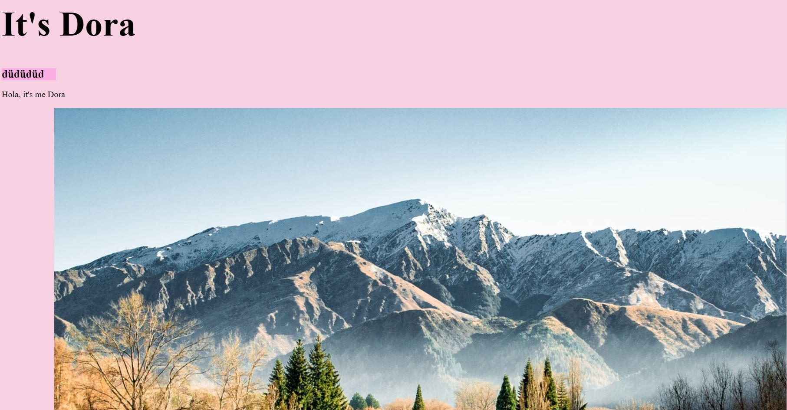

+++
title = "𝐓𝐡𝐞 𝘀𝘆𝘀𝘁𝗲𝗺..."
date = "2020-11-04"
draft = false
pinned = false
image = "photo-1602432596754-630e919e67a7.jpg"
+++
Damit wir die grundlegenden Züge des Programmierens einer Webseite erkennen und verstehen können, haben wir dafür 2 Lektionen aufgewendet. Wir haben weiter an unserer Übungswebsite gearbeitet, so haben wir heute nicht nur html zum Programmieren genutzt, sondern auch css. Dies ist ein Teil des Programmierens, welcher wir heute neu dazu gelernt haben. CSS fokussiert sich vor allem auf das Design der Webseite, d.h. auf das Design der einzelnen Elemente.

Dabei haben uns während dem Unterricht auch einige politische Themen beschäftigt. Denn während wir hier das Programmieren lernen, werden die Wahlzettel in den USA rasant gezählt. Auch der Bundesrat hat heute eine Medienkonferenz zu möglichen neuen Massnahmen auf Grund von Corona abgehalten. 

